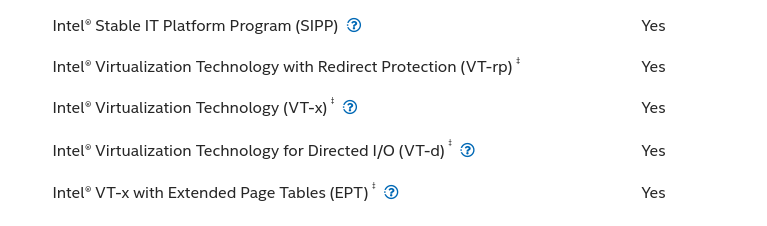

To enable GPU passthrough, you need a CPU that supports virtualization. Without this capability, your system won't be able to run GPU passthrough effectively. Here's how to choose the right CPU.

## CPU Virtualization Support

Virtualization support is crucial for efficient virtual machine performance and successful GPU passthrough. You'll need to enable this feature in your BIOS after selecting a suitable CPU.

<Callout type="info">
As of 2024, most CPUs include virtualization features by default. However, it's still important to verify that your CPU supports it!
</Callout>

To check if your CPU supports virtualization:

1. Visit the official website of your CPU manufacturer.
2. Look for the specifications or features section related to virtualization support.
3. Confirm that your CPU supports virtualization technology (Intel VT-x or AMD-V).

| AMD CPU   | Intel CPU |
|-----------|-----------|
| IOMMU     | VT-d      |
| NX Mode   | VT-x      |
| SVM Mode  |           |

Ensuring that your CPU has proper virtualization support is a crucial step for setting up dual GPU passthrough successfully.

## Performance Considerations

For the best experience with GPU passthrough, consider these CPU factors:

- **Core Count:** More cores allow you to allocate sufficient resources to both host and VM
- **CPU Generation:** Newer generations typically have better virtualization support

## Example of a supported CPU

**Intel® Core™ i9-13900K Processor:**

Visit the [official specifications page](https://www.intel.com/content/www/us/en/products/sku/230496/intel-core-i913900k-processor-36m-cache-up-to-5-80-ghz/specifications.html)

<Callout type="success">
When possible, choose a CPU from a recent generation with at least 6 cores for the best passthrough experience.
</Callout>
