Setting up passthrough on GNU/Linux is a breeze. You won't need extra drivers like VirtIO because GNU/Linux has what you need built right in. This makes the setup smoother and simpler.

## 1. Important Considerations

### 1.1 UEFI and BIOS

When setting up your virtual machine, make sure you download a UEFI-compatible ISO file. GNU/Linux comes in both BIOS and UEFI versions, so it's important to choose the right one.

<Callout type="warn">
If you don't use the correct version, your system might not boot properly.
</Callout>

### 1.2 Picking a GNU/Linux Distribution

Choosing a GNU/Linux distro is all about personal preference. Whether you like Arch Linux, Ubuntu, or NixOS, it's up to you. The passthrough setup process will be similar no matter which one you pick.

## 2. Getting Started

### 2.1 Download the GNU/Linux Distribution ISO

First things first, download the ISO file of the GNU/Linux distribution you want to install. This is the starting point for your passthrough setup. To speed up the download, you can use `aria2` with this command:

```shell
aria2c -x 16 "your_gnu_linux_iso_file.iso"
```

With your ISO ready, let's move on to setting up the VM.

## 3. Setting Up the Virtual Machine

Now that you have your ISO, it's time to create your VM with Virt-Manager:

### 3.1 Create a New VM

Open Virt-Manager and start a new VM setup. Choose `Local install.`

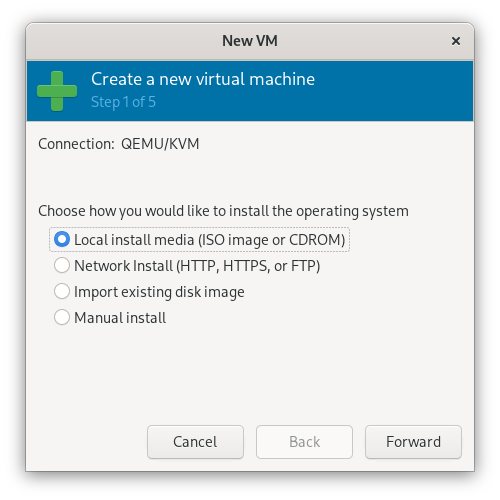

### 3.2 Choose the ISO

Select the GNU/Linux ISO you downloaded as the installation media.

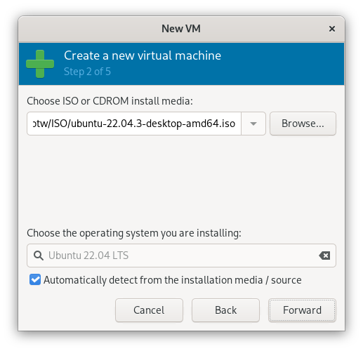

### 3.3 Configure RAM and CPU

Set how much RAM and how many CPU cores you want for your VM.

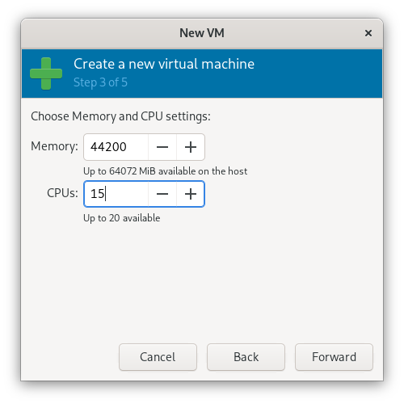

### 3.4 Set Up Disks and Enable Storage

Allocate disk space and enable storage support.

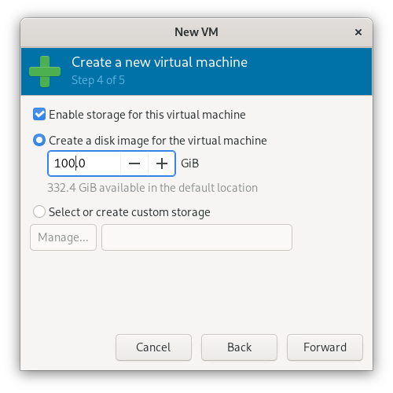

### 3.5 Ready to Install

Make sure custom settings are enabled for the installation.

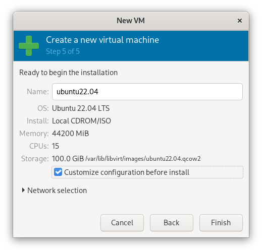

## 4. Preparing for Installation

With your VM set up, let's prepare for installing Linux:

### 4.1 Choose UEFI Firmware

Select the UEFI firmware option for your VM, like `UEFI x86_64 OVM_CODE.fd.`

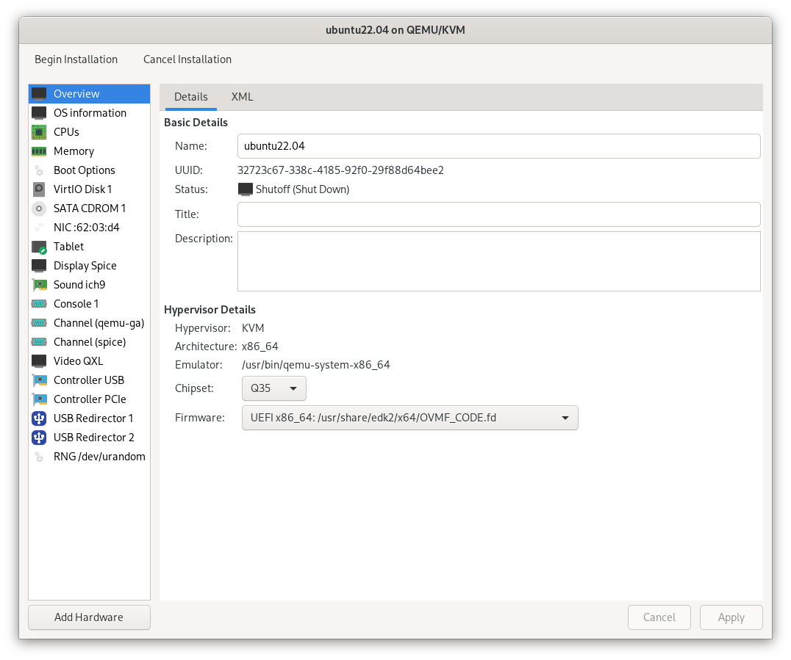

### 4.2 Configure Boot Options

Enable the boot menu and set `SATA CDROM1` as the first boot device to boot from the ISO.

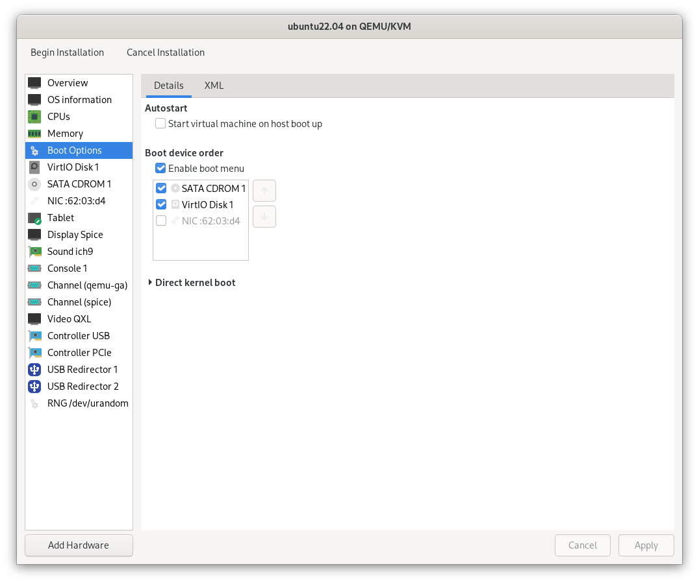

Now your VM is set up to start the GNU/Linux installation process. Click the `Begin Installation` button to proceed.

### 4.3 TianoCore

When you start your VM, you should see the TianoCore UEFI logo. 

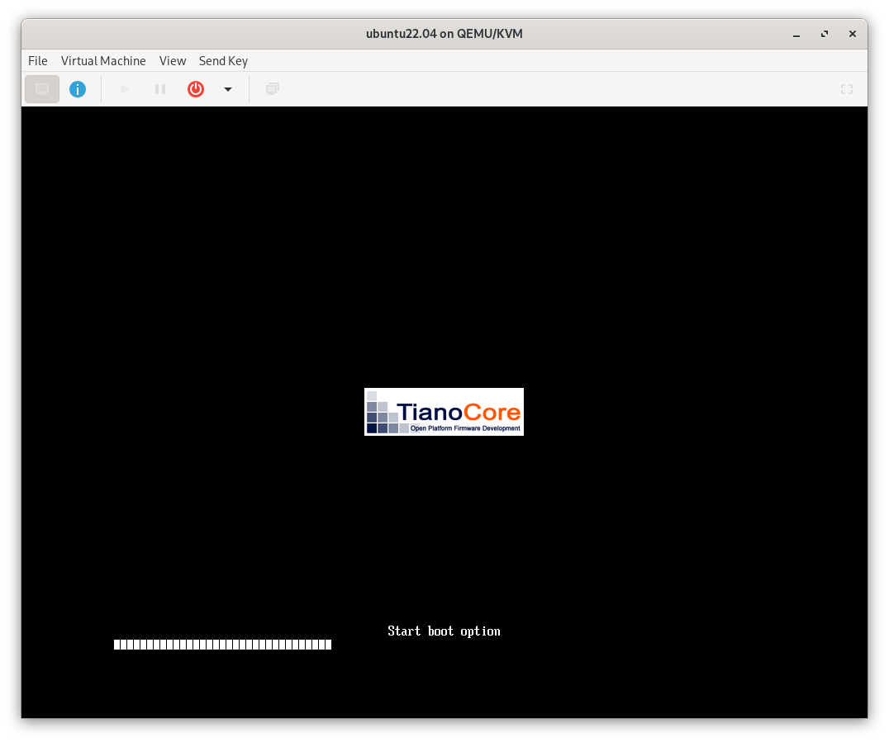

## 5. Installing Your GNU/Linux System

Now, install your chosen GNU/Linux distribution on the VM. Follow the usual installation prompts:

1. **Boot from ISO:** Start the VM and boot from the ISO.
2. **Follow Prompts:** Choose your language, keyboard layout, and disk partitions.
3. **Update and Install Software:** After installation, update your system and install any needed software.

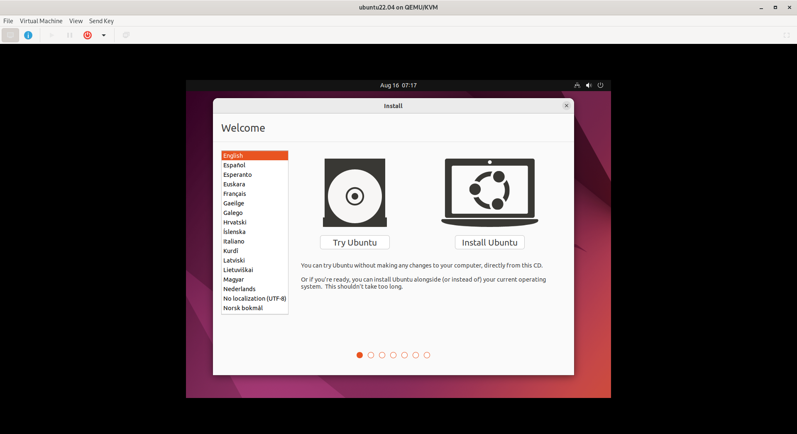

With GNU/Linux installed, you're almost done with the passthrough setup. Next, we'll enable network access and GPU passthrough.

## 6. Configuring Hardware Passthrough

Here's how to get network access, upgrade your system, and set up GPU passthrough:

### 6.1 Adding Hardware

1. **Power Off the VM:** Make sure your VM is off.
2. **Add PCI Devices for GPU Passthrough:** In Virt-Manager, go to `Add Hardware` and choose `PCI Host Device.` Add your GPU and GPU audio device.
3. **Add a PCI Network Device:** Also, add a PCI network device.
4. **Apply Changes and Start the VM:** Save the settings and start your VM.

### 6.2 Upgrading Your System

Open a terminal and run:

```shell
sudo apt-get update -y
sudo apt-get upgrade -y
sudo apt-get full-upgrade -y
```

Reboot your VM. Your GPU should now be passed through.

### 6.3 Checking GPU Passthrough

Install `neofetch` to check if the GPU is recognized:

```shell
sudo apt-get install neofetch
```

Run `neofetch` to see your GPU details.

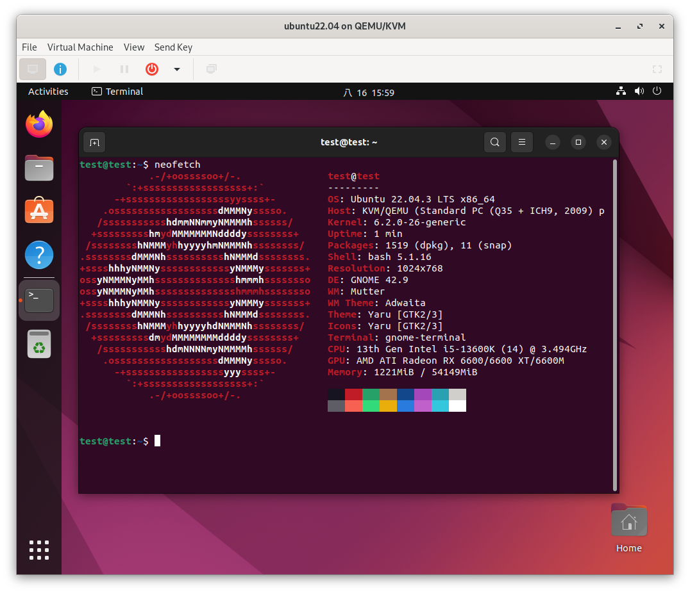

## 7. Optimizing Monitor Configuration

For the best visual experience, adjust your monitor settings:

1. **Power Off Your VM:** Shut down your VM.
2. **Configure VM Video Settings:** In Virt-Manager, go to the `Video` section and select the `Ramfb` device model.
3. **Switch Monitor Input:** Change your monitor's input to HDMI2 or another secondary option.

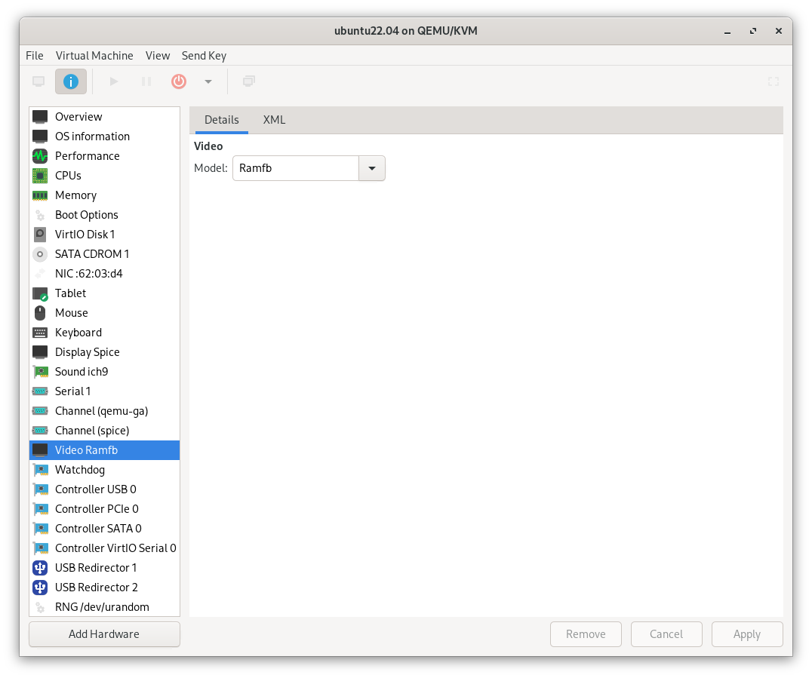

Now, your monitor should display the VM's output on the secondary input.

## You're All Set!

Congratulations! You've successfully set up a GNU/Linux virtual machine with GPU passthrough. Enjoy the power and flexibility of your new setup.
