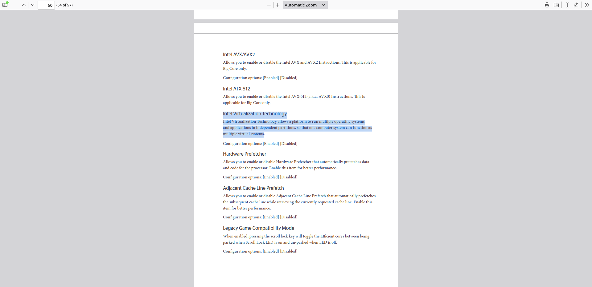

The motherboard is crucial for GPU passthrough. Make sure it supports virtualization technology.

## Motherboard Compatibility

To confirm compatibility, review the motherboard's full documentation, usually available in PDF format.

<Callout type="warn">
Not all motherboards support the virtualization features required for GPU passthrough, even if they're modern or high-end.
</Callout>

Follow these steps to ensure your motherboard is suitable:

1. Check the motherboard's manual or official documentation.
2. Look for details on IOMMU support or hardware virtualization features.
3. Verify that the motherboard supports both IOMMU technology and general virtualization for dual GPU passthrough.

Use `Ctrl + F` to search for these terms in the documentation:

| AMD CPU  | Intel CPU |
|----------|-----------|
| IOMMU    | VT-d      |
| NX Mode  | VT-x      |
| SVM Mode |           |

## Example of a Compatible Motherboard

**Intel Z790/H770/B760 Series Motherboard**

Visit the [official documentation](https://download.asrock.com/Manual/Software/Intel%20B760/Software_BIOS%20Setup%20Guide_English.pdf)

<Callout type="success">
Most modern gaming or workstation motherboards support virtualization, but always verify in the documentation before purchase.
</Callout>
